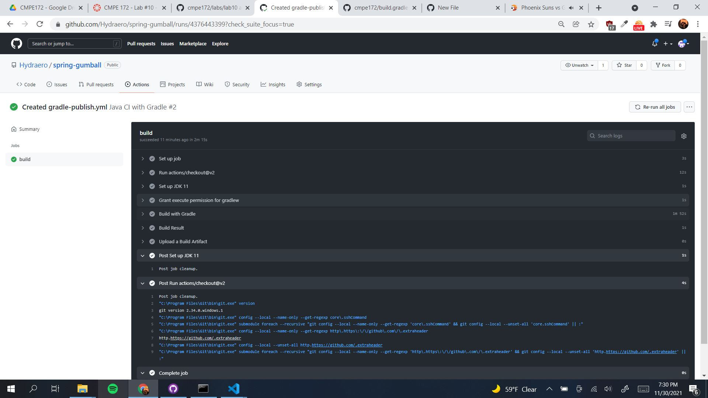
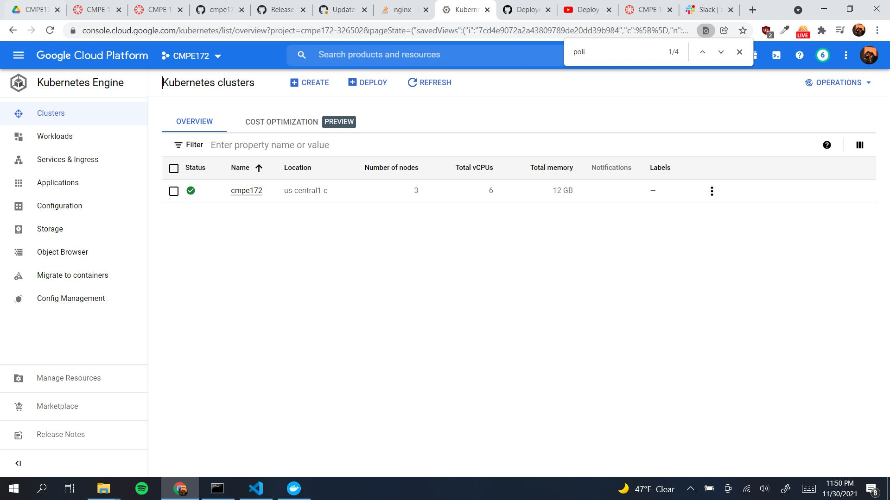
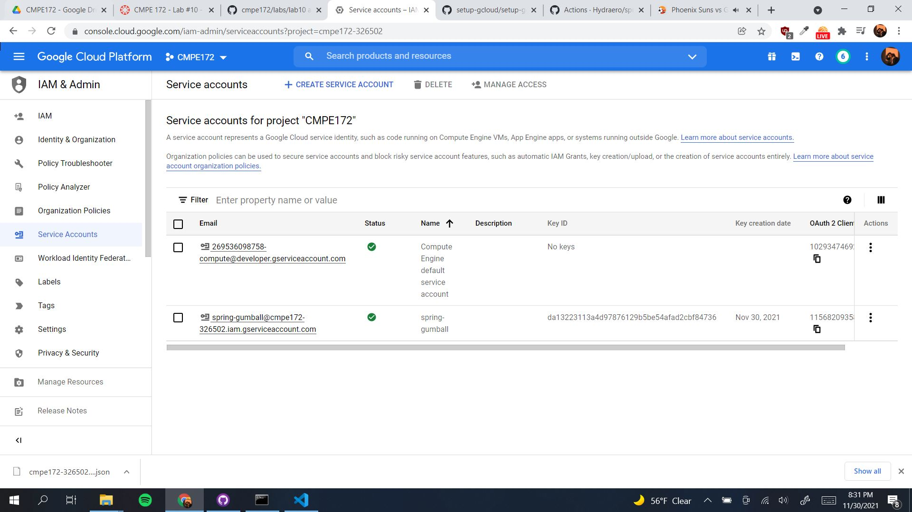
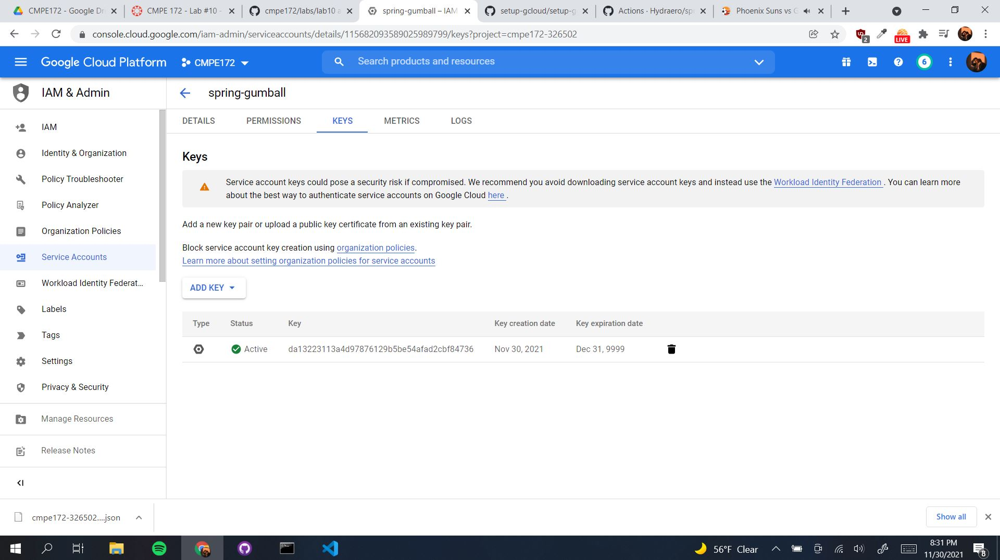
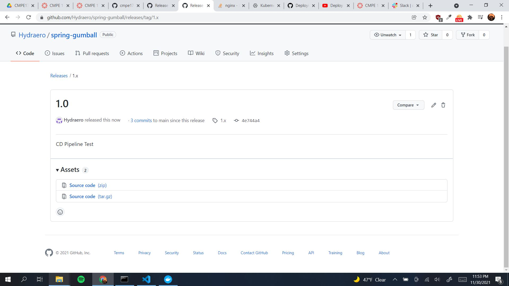
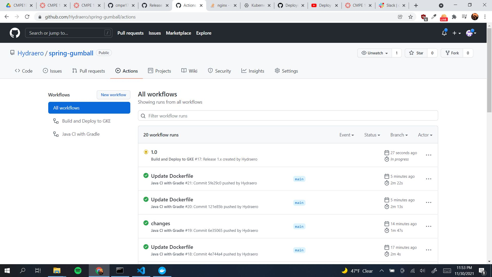
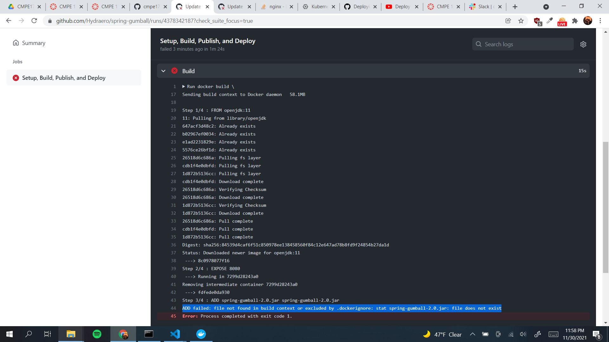
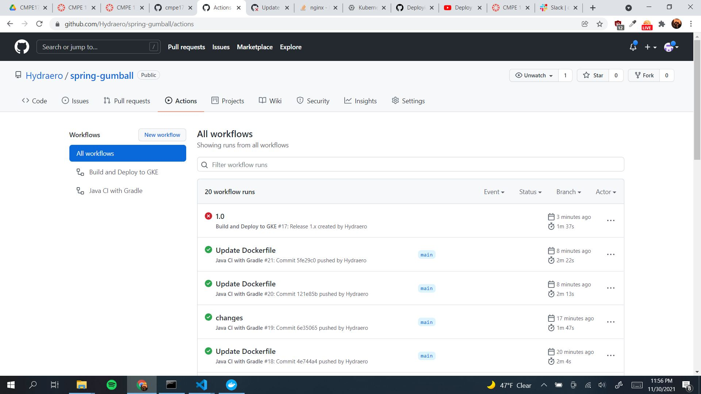

# CMPE 172 Lab 10 by Richard Tumaneng

## Spring-Gumball

**The Screenshot above shows my CI Pipeline building normally**

**The Screenshot above shows GKE Cluster running normally**

**The Screenshot above shows my Service account running normally**

**The Screenshot above shows my Service account's key**

**The Screenshot above shows my CD Pipeline release**

**The Screenshot above shows my workflow right as I created my release**

**The Screenshot above shows the error I kept recieving when the CD pipeline builds the docker image. I am not sure why this kept happening as I have my build/libs folders with the spring-gumball-2.0.jar file within it. I could not get past this error so I could not get further with the lab as well.**

**The Screenshot above shows my CI and CD Workflow**
## Lab Notes Discussion
